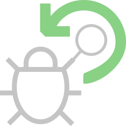
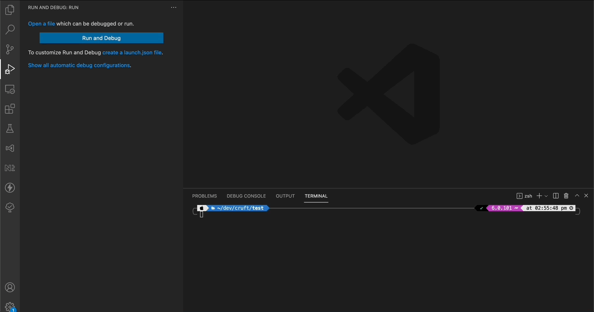

### Forked from [Dennis Jung VS Code - .NET Auto Attach](https://gitlab.com/dennismaxjung/vscode-dotnet-auto-attach)

<h1 align="center">
  <br>
    
  <br>
	VS Code - .NET Watch
  <br>
  <br>
</h1>
<h4 align="center">Enables a seamless debugging experience when working with dotnet-watch.</h4>

The ".NET Watch" extension is created to enable a .Net Core debugging experience closer to Visual Studio.
".NET Watch" re-attaches the debugger for seamless debugging experience.

## Getting Started

1. [Install the extension](https://marketplace.visualstudio.com/items?itemName=Murugaratham.vscode-dotnet-watch)
1. Open the folder containing .net core Project(s).
1. Press F5 and select .NET Watch
1. Save file changes and 🤯

<h1 align="center">
  <br>
    
		
  <br>
</h1>

### Supports launch profiles (Visual Studio)

[Launch Profiles](https://github.com/OmniSharp/omnisharp-vscode/blob/master/debugger-launchjson.md#launchsettingsjson-support) has limited supported for VS Code but it works based on personal tests

### Sample launch config for a compound tasks

Multiple projects can be debugged in a single launch by using compound tasks.

```json
[
	{
		"type": "DotNetWatch",
		"request": "launch",
		"name": ".NET Core Watch: dotnet-test.console",
		"project": "dotnet-test.console.csproj",
		"env": {
			"ASPNETCORE_ENVIRONMENT": "Development"
		}
	},
	{
		"type": "DotNetWatch",
		"request": "launch",
		"name": ".NET Core Watch: dotnet-test2.console",
		"env": {
			"ASPNETCORE_ENVIRONMENT": "Development",
			"DOTNET_WATCH_RESTART_ON_RUDE_EDIT": "true"
		},
		"launchBrowser": {
			"enabled": true,
			"args": "${auto-detect-url}",
			"windows": {
				"command": "cmd.exe",
				"args": "/C start ${auto-detect-url}"
			},
			"osx": {
				"command": "open"
			},
			"linux": {
				"command": "xdg-open"
			}
		}
	}
]
...
"compounds": {
	{
		"name": "Watch all",
		"configurations": [
			".NET Core Watch: dotnet-test2.console",
			".NET Core Watch: dotnet-test.console"
		]
	}
}

```

### Configuration Attributes

| Configuration Attributes | Type     | Description                                                                                                 | Default |
| ------------------------ | -------- | ----------------------------------------------------------------------------------------------------------- | ------- |
| args                     | string[] | Command line arguments passed to the program.                                                               | []      |
| env                      | object   | Environment variables passed to the program. (note: this has precedence over Visual Studio Launch Profiles) | {}      |
| project                  | string   | The project (.csproj) to start, if not provided, a quick pick menu will appear                              | ""      |

## For existing Launch.json

Delete it and generate or update launch.json configuration type from `"coreclr"` to `"DotNetWatch"`
and remove the `"preLaunchTask"`, `"program"`, `"cwd"` (feel free to add them if you need)

## Watching externally executed `dotnet watch`

Select the process you want to watch and let it reattach :)

## Release Notes & Known Issues

See the [CHANGELOG.md](CHANGELOG.md) for the details of changes for each version and known issues.

## License

This project is licensed under the MIT License - see the [LICENSE.md](LICENSE) file for details.

## Coffee

If this extension helped you, consider buying me a [coffee](https://www.buymeacoffee.com/muru)
